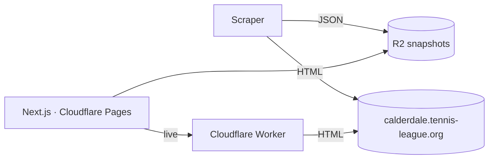

# Calderdale Tennis League — modern frontend

A re-imagined, personalised public-view frontend for [calderdale.tennis-league.org](https://www.calderdale.tennis-league.org/), built as a static-first PWA.

> Not affiliated with the Calderdale Tennis League. Data is sourced from their public site by polite scheduled scraping.

## Status

Phase 1 in progress: foundation, parser, domain types. See `docs/superpowers/plans/` for plans and `docs/superpowers/specs/` for the design spec.

## Project shape



## Repo layout

```
packages/domain     Zod schemas + TS types
packages/parser     HTML → domain objects (pure functions)
apps/parse-cli      Phase 1 CLI: fetch any supported URL, print JSON
fixtures/           Captured HTML for parser tests
docs/superpowers/   Specs and implementation plans
```

## Quickstart

```bash
pnpm install
pnpm test
pnpm parse "<url>"
```

See `apps/parse-cli/README.md` for example URLs.
