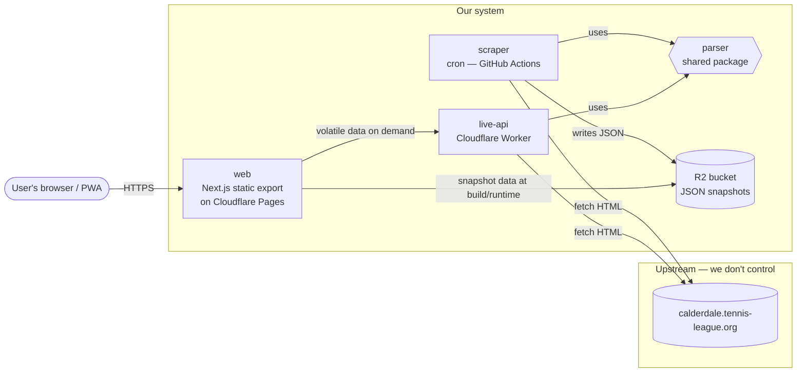
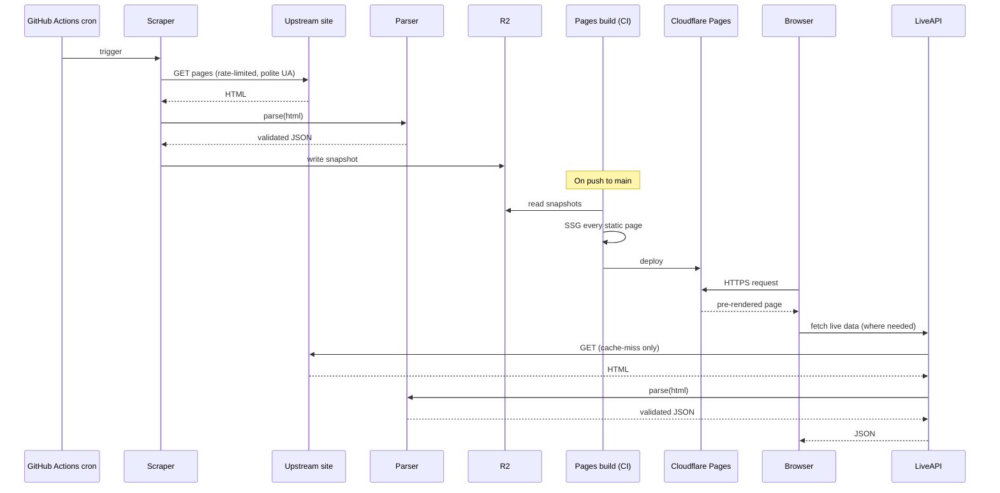
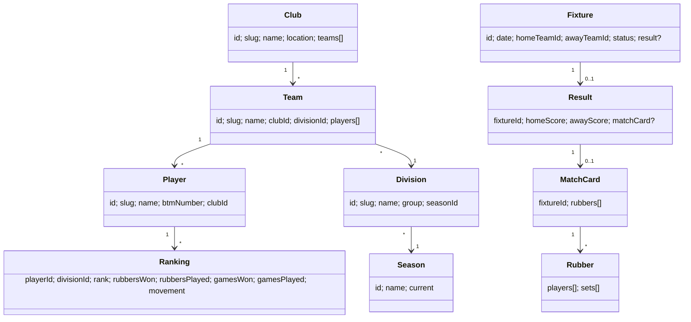
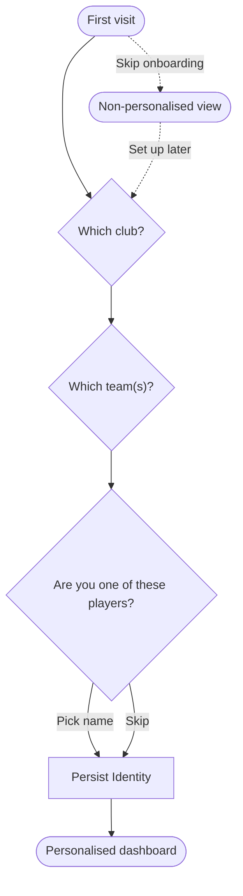

# Calderdale Tennis League — modern frontend

**Status:** design approved 2026-05-15 · awaiting written spec review
**Author:** Dan

## Summary

A modern, personalised public-view replacement frontend for the Calderdale Tennis League site (`https://www.calderdale.tennis-league.org/`). The original is server-rendered PHP from the early 2000s with no JSON API; we treat its public pages as a data source by scraping HTML into JSON. The user opens our app, picks club → team(s) → optionally themselves once, and the home screen becomes a dashboard about *their* tennis: next fixture with a "you vs them" preview, recent form, league position trajectory, personal ranking with movement. Below that is a fast, modern view of the wider league. Installable as a PWA, calendar-syncable, share-friendly.

## Goals

- Cover every public-view feature of the existing site (league tables, fixtures & results, match cards, player rankings, contacts, locations, archive).
- Make the dominant use case — *"how is my team doing?"* — a one-glance answer rather than a five-dropdown drill-down.
- Add value the original cannot: form indicators, trajectory charts, head-to-head, single-page club views, full player profile pages, universal search, calendar/share/PWA.
- Deploy as a static-first PWA that can later be wrapped with Capacitor for iOS/Android with no rewrite.

## Non-goals (v1)

- Logged-in functionality (results entry, admin tooling, captain workflows).
- Native iOS/Android apps — deferred; the PWA is the mobile story for now.
- Live match-night mode (auto-refreshing live results during play).
- Streaks & notable runs ("5-match unbeaten" badges).
- Public launch — single-user (the author) until the league is consulted.

## Decisions captured during brainstorming

| Decision | Choice | Why |
|---|---|---|
| Data acquisition | Hybrid: scheduled snapshot + tiny live API | Most data changes slowly; only fixtures/results during the season need freshness. Same parser serves both. |
| Primary user | Player or admin, with personalisation as the spine | Every visitor is in the league. "Pick your team(s) once" beats every-page dropdown selection. |
| Visual direction | Friendly Community (Notion/Discord-ish) | Warm, rounded, sociable — fits 17 small clubs and a player-knows-player culture. |
| Mobile strategy | PWA-first, Capacitor wrap later | Honours YAGNI today, preserves the option without paying for it. Web push works on iOS 16.4+. |
| Tech stack | Next.js 15 static export + Tailwind + shadcn/ui + Recharts + next-pwa | Most well-trodden path for static PWA → Capacitor. Best component ecosystem for sparklines, virtualised tables, search UX. |

## v1 feature set

Selected from the full candidate list (the rest are deferred):

- ★ **Personalised home dashboard** — "your team(s) this week"
- ★ **Form indicators** — last-5 W·L·W·W·L pills on tables and rankings
- ★ **"You vs them" pre-match card** — opponent form, position, historical head-to-head, likely lineup
- ★ **Trajectory charts** — sparklines for team position and personal ranking over the season
- ★ **Multi-team pinning** — one user can pin several teams (Mens + Mixed, captain of multiple, club admin)
- ★ **Universal search** — Cmd-K modal for players, teams, clubs
- ★ **Single-page club view** — one URL per club: all teams, positions, upcoming fixtures, top players, location
- ★ **Player profile pages** — full season per player: every rubber, opponents, scores, ranking history, form
- ★ **One-tap calendar add** — Google/Apple Calendar buttons (existing site has ICS but it's buried)
- ★ **Share-friendly result cards** — generate a clean image/link for WhatsApp from any match card
- ★ **PWA + push notifications** — install to home screen; push on result-posted and 24h-fixture-reminder

## System architecture



### Component responsibilities

- **`parser`** — pure functions of shape `(html: string) => Result<DomainObject>`. Zero side-effects. Fully unit-testable against fixture HTML. Shared by `scraper` and `live-api`.
- **`scraper`** — TypeScript script. Walks every public URL on the upstream site, calls `parser`, writes JSON files to R2. Runs on cron (hourly during the season, daily off-season). Idempotent.
- **`live-api`** — Cloudflare Worker. Same `parser`, on demand for volatile data (today's results, current standings). Caches responses 2-5 min in Workers KV.
- **`web`** — Next.js 15 app, static-exported (`output: 'export'`). Reads JSON from R2 at build time for static pages; fetches `live-api` from the browser for live bits.

### Data flow



## Repository structure

pnpm workspaces monorepo:

```
calderdale-tennis-league/
├── apps/
│   ├── web/              Next.js 15 frontend
│   ├── scraper/          TS script, runs in CI
│   └── live-api/         Cloudflare Worker
├── packages/
│   ├── parser/           HTML → domain objects (pure)
│   ├── domain/           Zod schemas + TS types
│   └── ui/               shadcn/ui-based component library
├── fixtures/             Captured HTML snapshots for parser tests
├── .github/workflows/
│   ├── scrape.yml        Cron-triggered scraper
│   ├── deploy-web.yml    Pages deploy on push to main
│   └── deploy-api.yml    Worker deploy on push to main
└── pnpm-workspace.yaml
```

## Domain model

Shared types in `packages/domain`, defined as Zod schemas with inferred TS types. Functional / immutable; no classes.



## Frontend — pages

Next.js App Router; all `output: 'export'` compatible.

| Route | Purpose |
|---|---|
| `/` | Personalised home dashboard, or onboarding wizard if not set up |
| `/clubs` | All clubs list + map |
| `/clubs/[slug]` | Single-page club view: teams, positions, fixtures, top players, location |
| `/teams/[slug]` | Team page: fixtures, results, players, position trajectory |
| `/players/[slug]` | Player profile: full season, ranking history, form |
| `/divisions/[slug]` | League table + fixtures + rankings (tabbed) |
| `/seasons/[id]` | Archive entry — explore a past season |
| `/settings` | Manage pinned teams, identity, notification preferences |
| Cmd-K modal | Universal search (player / team / club) |

## Personalisation

State lives in `localStorage`, structured:

```typescript
type Identity = {
  pinnedTeams: TeamRef[]      // 1..n teams the user cares about
  selfPlayer?: PlayerRef      // optional "I am this player"
  notifications?: { resultPosted: boolean; fixtureReminder24h: boolean }
}
```

### First-run flow



A "Set up" button stays in the header so users can re-do or change at any time. Multi-team is supported from step 2 (checkboxes, not a single radio).

## Testing approach

- **`parser`** — golden-file tests against real captured HTML in `fixtures/`. Every supported page type has at least one fixture. New fixtures added whenever a parsing bug is fixed (regression coverage).
- **`domain` schemas** — round-trip tests (parse → validate → serialise → re-validate).
- **`web`** — component tests (Vitest + Testing Library) for personalisation logic, the first-run wizard, the home dashboard. Playwright smoke test of the critical user journey: open site → run wizard → land on dashboard → drill into team → drill into player.
- **`live-api`** — integration test against captured fixtures + a contract test against the live upstream (allowed to flake, alerts on failure).
- **End-to-end smoke** — daily GitHub Actions job hits a few representative pages and asserts schema validation passes; alerts loudly on parser drift.

## Risks & open questions

| Risk | Status | Mitigation |
|---|---|---|
| `refreshProtectionCode` session token in URLs | Needs spike | Try `refreshProtectionCode=0` first (seen in some examples). Otherwise warm-up request mints a token, then walk pages. |
| Parser brittleness vs upstream HTML changes | Accepted | Snapshot fixtures + parser unit tests + Zod schema validation at scrape time + daily smoke test. |
| Rate limiting / scraping etiquette | Accepted | 1 req/sec cap, polite User-Agent with contact address, respect robots.txt, aggressive caching. ~hundreds of pages, 10-15 min/run. |
| League blessing | **Deferred** — author is the only user during personal-use phase. Re-open before any public launch. | Polite "I'm a player, here's what I'd like to do" email to the league committee. |
| iOS PWA push requires install-to-home-screen | Accepted | Document the install step well; treat push as best-effort. Capacitor wrap solves it later. |
| Domain / identity confusion with the official site | Open | Pick a clearly distinct name (e.g. "CTL Companion") + "Not affiliated — data sourced from calderdale.tennis-league.org" footer. **TBD before any sharing.** |
| JSON snapshot storage: R2 vs git-tracked `data/` directory | Open | R2 is the design default. Alternative: scraper commits JSON to repo — simpler, free, debuggable diffs, but blows up the repo over time. Resolve in implementation planning. |

## Hosting & deployment

- **Web**: Cloudflare Pages, automatic deploy on push to `main`.
- **Live API**: Cloudflare Worker, deployed via Wrangler in CI on push to `main`.
- **Scraper**: GitHub Actions cron — hourly during the season, daily otherwise. Authenticated to R2 with a scoped API token.
- **Storage**: Cloudflare R2 for JSON snapshots; Cloudflare Workers KV for live-API response cache.
- **Cost**: comfortably within Cloudflare free tier for single-user / personal-launch traffic.

## Out of scope

- Logged-in / admin / captain functionality.
- Live match-night auto-refresh mode.
- Streaks & notable runs.
- Native iOS/Android apps.
- Multi-language / accessibility audit beyond shadcn/ui's defaults (revisit before public launch).
- Public launch.
