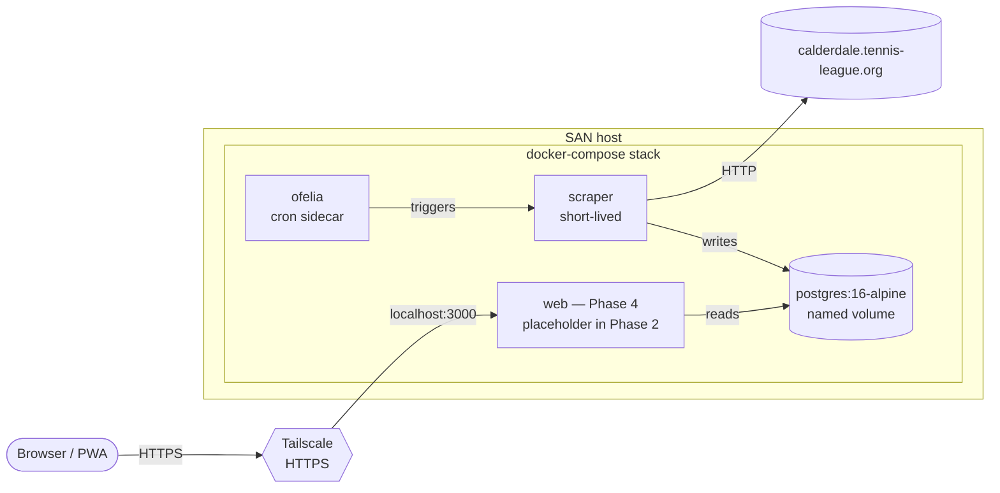
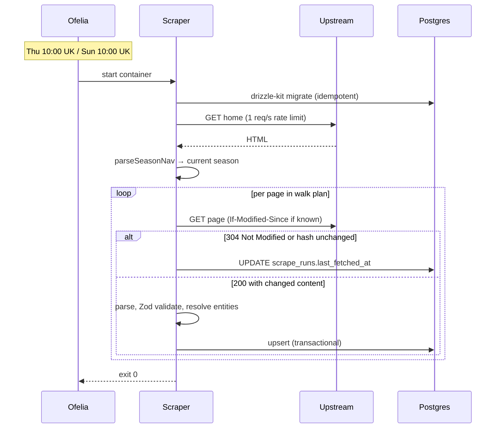

# Phase 2 — Scraper, data layer, Docker-on-SAN deployment

**Status:** design approved 2026-05-17 · awaiting written spec review
**Author:** Dan

## Summary

Phase 2 turns the Phase 1 parser into a working, refreshing data source backed by a real database. A short-lived scraper container walks the upstream Calderdale Tennis League site twice a week, validates with Phase 1's domain schemas, and upserts into a PostgreSQL instance running on the user's self-hosted SAN. A typed middle tier (`packages/data`) exposes read functions ready for the Phase 4 web app to consume.

The Phase 2 deliverable is a docker-compose stack that, once running on the SAN, keeps the database fresh with no manual intervention beyond a one-time historical backfill.

## Context

Phase 1 produced `packages/domain` (Zod schemas), `packages/parser` (three pure HTML→domain functions), and `apps/parse-cli`. Three page types are covered: clubs directory, league table, player rankings.

Phase 1's spec assumed Cloudflare hosting (Pages + Workers + R2). Phase 2 brainstorming pivoted to self-hosted Docker on the user's SAN, reachable via Tailscale, and replaced JSON-snapshot storage with PostgreSQL. See the prep doc `2026-05-17-phase-2-prep.md` for the six open questions whose resolutions drive this design.

## Goals

- Persist scraped league data in a queryable, typed store on the SAN.
- Run autonomously: twice-weekly schedule via ofelia, no manual intervention after backfill.
- Cover the four fragment endpoints not done in Phase 1: `displayResults.php`, `result_card_*.php`, `displayContacts.php`, `displayLocations.php`, plus the home page's season nav.
- Add a typed data-access middle tier (`packages/data`) ready for Phase 4 web.
- Provide one-shot backfill mode for historical seasons (Summer 2021+).
- Keep parsers pure: scraper, not parser, owns entity resolution and canonicalisation.
- Address Phase 1 carry-overs (stable IDs, parser asymmetry, fragment-URL detection, undici/cheerio cleanups).

## Non-goals (Phase 2)

- The web frontend itself — Phase 4. The `web` container in `docker-compose.yml` is deferred to Phase 4; Phase 2 ships compose with `postgres` + `scraper` + `ofelia` only.
- Live match-night auto-refresh mode — Phase 7+.
- User-writable data, logged-in features, admin tooling — Phase 6+.
- Off-SAN backups — Phase 3.
- Manual on-demand refresh UI — Phase 3.
- Multi-user / public access.

## Decisions captured during brainstorming

| Question | Choice | Why |
|---|---|---|
| Storage backend | PostgreSQL via Drizzle ORM | Genuinely relational data; tiny scale fits but earns a proper DB at no real cost; trivial migration path to managed Postgres later. |
| Hosting | Docker compose on user's SAN, accessed via Tailscale | Avoids cloud lock-in; SAN has spare compute; Tailscale provides HTTPS via Let's Encrypt on `*.ts.net` automatically. |
| Cadence | Twice weekly: Thu 10:00 UK + Sun 10:00 UK | Matches league rhythm (Tue/Thu matches, results posted within 24 h); no need for season-detection logic. |
| Scrape mechanism | Short-lived container fired by ofelia | Stateless scraper, schedule co-located with compose stack, no 24/7 scheduler process. |
| Archive scope | Current-only on schedule; manual `--season` / `--backfill` for archives | Frozen historical data shouldn't be re-scraped on each run. One-off backfill during Phase 2 commissioning. |
| Current-season discovery | Auto-detect from upstream nav | Self-maintaining across season rollovers. |
| Entity resolution | At scrape time; DB-backed alias tables; tentative `needs_review` rows | Parsers stay pure; data flow never blocks on unknown names; operator gets a punch list. |
| Live-API | None in v1 — all reads via DB through `packages/data` | v1 non-goals already exclude live mode; twice-weekly cadence is acceptable for personal use. |
| Image distribution | GitHub Actions → GHCR → SAN pull | SAN stays free of build toolchain; deploys are fast image pulls. |
| TLS | `tailscale serve --https=443` on SAN host | PWA / service workers / push need HTTPS even on LAN; Tailscale provisions Let's Encrypt cert automatically. |

## System architecture



### Container responsibilities

- **postgres** — `postgres:16-alpine`. Named volume for `/var/lib/postgresql/data`. Exposed only inside the docker network; not reachable from the host or tailnet. Single source of truth for league data.
- **scraper** — built from `apps/scraper`. Short-lived: ofelia starts it on cron, it runs one scrape end-to-end, exits with status code. No internal scheduler. Has `DATABASE_URL` env to reach postgres.
- **ofelia** — `mcuadros/ofelia:latest` daemon mode. Watches container labels for cron schedules and triggers them via the Docker socket. Single source of truth for scraping cadence.
- **web** *(Phase 4)* — not built in Phase 2; spec includes the wiring it will plug into.

### Data flow



## Repository structure (delta from Phase 1)

```
apps/
├── parse-cli/                       Phase 1, unchanged
├── scraper/                         ← NEW
│   ├── src/
│   │   ├── index.ts                 CLI flag parsing, mode dispatch
│   │   ├── orchestrator.ts          walks upstream, calls parsers, writes DB
│   │   ├── http-client.ts           rate limit, retries, conditional GET, hash dedup
│   │   ├── season-detector.ts       parses upstream nav for current season
│   │   ├── entity-resolver.ts       alias-table-backed canonical lookups
│   │   └── modes/
│   │       ├── current.ts           default — walks current season only
│   │       ├── season.ts            --season=X — one historical season
│   │       └── backfill.ts          --backfill — all historical seasons
│   ├── tests/
│   └── Dockerfile

packages/
├── domain/                          Phase 1, unchanged
├── parser/                          Phase 1 parsers + NEW fragment parsers
│   └── src/
│       ├── parse-clubs-directory.ts        (Phase 1, refactored — see carry-overs)
│       ├── parse-league-table.ts           (Phase 1)
│       ├── parse-player-rankings.ts        (Phase 1)
│       ├── parse-season-nav.ts             ← NEW
│       ├── parse-fixtures-and-results.ts   ← NEW
│       ├── parse-match-card.ts             ← NEW
│       ├── parse-club-contacts.ts          ← NEW
│       ├── parse-club-location.ts          ← NEW
│       ├── page-type.ts                    extended: shell + fragment dispatch
│       └── http.ts                         (Phase 1 — to be removed; scraper owns HTTP)
├── db/                              ← NEW
│   ├── src/
│   │   ├── schema/                  Drizzle table definitions
│   │   ├── client.ts                postgres connection
│   │   └── migrations/              generated by drizzle-kit
│   └── package.json
└── data/                            ← NEW (minimal initial surface)
    ├── src/
    │   ├── clubs.ts                 getClub, listClubs
    │   ├── divisions.ts             getDivisionTable, listDivisions
    │   ├── fixtures.ts              getFixture, listUpcomingFixtures
    │   ├── players.ts               getPlayer, listPlayersByClub
    │   ├── rankings.ts              getRankingsByDivision
    │   └── seasons.ts               getCurrentSeason, listSeasons
    └── package.json

infra/                               ← NEW
├── docker-compose.yml
├── scraper.Dockerfile
└── postgres.env.example

.github/workflows/                   ← NEW
└── build-images.yml                 build + push scraper image to GHCR on main

fixtures/                            Phase 1 + new captured HTML for fragment endpoints
```

## Database schema

Drizzle TypeScript schemas in `packages/db/src/schema/`. Headline shape:

```
seasons          id, slug, name, current (bool)
divisions        id, slug, name, group ('Mens'|'Ladies'|'Mixed'), season_id (fk)

clubs            id, slug (unique), canonical_name, needs_review (bool)
club_aliases     id, club_id (fk), observed_name (unique)

teams            id, slug, name, club_id (fk), division_id (fk)

players          id, slug, name, btm_number (nullable), club_id (fk), needs_review
player_aliases   id, player_id (fk), observed_name (unique)

fixtures         id, date, home_team_id (fk), away_team_id (fk),
                 division_id (fk), status (enum)
results          fixture_id (fk pk), home_score, away_score

match_cards      id, fixture_id (fk unique)
rubbers          id, match_card_id (fk), order_in_card,
                 home_player_ids (int[]), away_player_ids (int[])
set_scores       id, rubber_id (fk), order_in_rubber, home_score, away_score

rankings         id, player_id (fk), division_id (fk), rank,
                 rubbers_won (numeric), rubbers_played (numeric),
                 games_won, games_played, ranking_score (numeric),
                 movement (enum)

scrape_runs      url (pk), last_fetched_at, last_modified, content_hash,
                 last_status, last_parse_ok, last_error
```

Numeric columns (`rubbers_won`, `rubbers_played`, `ranking_score`, plus any score field that can hold half-points) use Postgres `numeric` not `integer` — see the half-points memory note.

**Stable IDs:** Drizzle assigns serial PKs at first insert. Natural keys (slugs, BTM numbers where available) are uniqueness-indexed. The Phase 1 "synthetic positional ID" problem (insertion-order-dependent) evaporates: IDs persist across runs via upsert-by-slug.

**Migrations:** generated by `drizzle-kit generate`, version-controlled in `packages/db/src/migrations/`. The scraper container runs `drizzle-kit migrate` at startup before any parsing — idempotent.

**Domain-to-DB mapping:** Zod schemas in `packages/domain` describe the *API contract*; Drizzle tables describe *physical storage*. The two are deliberately separate. `packages/data` exposes domain-shaped objects, hiding the DB row layout from consumers.

## Scraper design

### Modes

```
pnpm scrape              # default: current season only — what ofelia fires
pnpm scrape --season=X   # one historical season, manual
pnpm scrape --backfill   # all historical seasons, manual one-off
```

### Default (current) mode flow

1. Run pending DB migrations.
2. `GET` upstream home page.
3. `parseSeasonNav(html)` → current season slug + id.
4. For the current season, walk in this order:
   - Clubs directory (feeds alias tables)
   - Locations directory (per-club coordinates)
   - Contacts (per-team contact details)
   - Per division: league table, fixtures & results, player rankings
   - Per played fixture not already cached: match card
5. Each HTTP request: 1 req/s rate limit, conditional `If-Modified-Since` if `scrape_runs` has a prior value, 30 s timeout, 3-retry exponential backoff on transient errors.
6. Each response: if status 304 or SHA-256 of body matches stored hash, skip parsing. Otherwise: parse, Zod-validate, resolve entities, upsert in a transaction. Update `scrape_runs` either way.
7. Exit 0 on success; exit 1 on fatal error (DB unreachable, can't read home page, etc.). Per-page parse failures log and continue — one broken page must not abort the run.

### Cadence

```yaml
# infra/docker-compose.yml
ofelia:
  image: mcuadros/ofelia:latest
  command: daemon --docker
  environment:
    TZ: Europe/London          # required — interprets cron expressions in UK time
  volumes:
    - /var/run/docker.sock:/var/run/docker.sock:ro

scraper:
  labels:
    ofelia.enabled: "true"
    ofelia.job-run.scrape.schedule: "0 10 * * 4,0"   # Thu 10:00, Sun 10:00 UK
    ofelia.job-run.scrape.container: scraper
```

The `TZ` env on ofelia is load-bearing: without it the schedule fires at 10:00 UTC, which is 11:00 BST in summer.

### HTTP client

```typescript
{
  userAgent: 'CalderdaleLeagueMirror/0.2 (contact: dan.chicot@gmail.com; non-affiliated personal mirror)',
  rateLimitMs: 1000,
  requestTimeoutMs: 30_000,
  retries: {
    maxAttempts: 3,
    backoffMs: [2_000, 4_000, 8_000],
    retryOn: { statuses: [502, 503, 504], networkErrors: true },
  },
  conditionalGet: true,
  contentHashDedup: true,
  respectRobotsTxt: true,
}
```

`robots.txt`: fetched once per scraper invocation, cached for the run. Disallowed paths skipped with a log line. If the upstream disallows everything (very unlikely), the scraper aborts and surfaces this for operator decision.

## Entity resolution

At scrape time, in `entity-resolver.ts`. Parsers return raw row types with observed names; the resolver maps each observed name to a canonical id via `club_aliases` / `player_aliases`.

**Unknown name → graceful unknown:**
- Create a tentative `clubs` (or `players`) row with `needs_review = true`.
- Create an alias row pointing to it.
- Continue the run.

**Operator workflow:**
```sql
SELECT * FROM clubs WHERE needs_review = true;
```
Operator either clears the flag (real new entity) or merges (`UPDATE club_aliases SET club_id = <real> WHERE club_id = <tentative>; DELETE FROM clubs WHERE id = <tentative>;`).

**Initial seed:** migration with the known mapping — `Halifax Queens` ↔ `Queens Sports Club`. Other pairs surfaced during fragment parser development get appended to the seed migration.

## Middle tier (`packages/data`)

Pure TypeScript functions consumed by `apps/web` in Phase 4 and (when added) by `/api/*` routes and the future Capacitor app:

```typescript
// packages/data/src/divisions.ts
export const getDivisionTable = async (slug: string): Promise<DivisionTable> => {
  // Drizzle query joining divisions ⋈ teams ⋈ league_table_rows
  // Returns a page-shaped object validated against the domain Zod schema
};
```

- Functions return *domain-shaped* objects (matching `packages/domain` Zod types), not Drizzle row types.
- Stateless given the DB.
- Joins live here — not in pages, not in the schema layer.
- No "live vs snapshot" distinction: every read hits Postgres.

Phase 2 ships only the minimal getters needed to validate the schema works for plausible read patterns (one per top-level entity). Phase 4 adds more as the pages need them.

## Build & deployment

### Build pipeline

GitHub Actions on push to `main`:
- Build scraper image from `infra/scraper.Dockerfile`.
- Push to `ghcr.io/danielchicot/calderdale-league-scraper:latest` and `:<sha>`.
- (Future) same workflow extended for the web image in Phase 4.

### SAN side

`/opt/ctl/docker-compose.yml`:
- `postgres` with named volume for `/var/lib/postgresql/data` and `restart: unless-stopped`
- `ofelia` with docker socket mount, daemon mode
- `scraper` pulled from GHCR, `restart: "no"` (short-lived), labeled with ofelia schedule
- Env: `DATABASE_URL`, `LOG_LEVEL`, `SCRAPER_USER_AGENT_CONTACT`

Deploy: `git pull && docker compose pull && docker compose up -d`.

### Tailscale

`tailscale serve --https=443 --bg http://localhost:3000` on the SAN host. Web (Phase 4) listens on `localhost:3000`; Tailscale serves it as HTTPS on the SAN's `*.ts.net` hostname. Phase 2 doesn't need this yet but the spec captures it so Phase 4 doesn't re-derive it.

## Phase 1 carry-overs (addressed in Phase 2)

| Carry-over | Resolution |
|---|---|
| Synthetic positional IDs unstable across runs | Drizzle serial PKs + slug uniqueness indexes; upsert-by-slug keeps IDs stable. |
| Parser return-shape asymmetry (`Club[]` vs row types) | Standardise: all parsers return *row types* (observed-name + raw values). Canonical domain mapping is the scraper's job. Refactor `parseClubsDirectory` to match before adding new parsers. |
| `detectPageType` only knows shell URLs | Split into `detectShellPageType` (current logic) + new `detectFragmentType` (for `displayResults.php`, `result_card_*.php`, etc.). Public `detectPageType` dispatches between them. |
| undici version mismatch (root v8, parser v6) | Drop undici from `packages/parser`. Use Node 24 built-in `fetch` everywhere. Remove from root devDeps if the spike script no longer needs it. |
| `import * as cheerio` style | Migrate existing parsers to `import { load } from 'cheerio'`. Set the precedent for new parsers from the start. |
| `Ranking.rubbersWon` / `rubbersPlayed` half-points | Already fixed (commit `16ce9f2`). Confirm: Phase 2 parsers must use `parseDecimalStrict` for any field that can be `.5` (pointsWon, pointsLost, rubbersWon, rubbersPlayed, rankingScore). |

## CSRF / session token follow-up

Phase 1 confirmed `refreshProtectionCode=0` works for shell pages and `displayResults.php`. It is **unverified** for `displayContacts.php`, `displayLocations.php`, and `result_card_*.php`. Phase 2 implementation **must probe these endpoints early** — before building the full scraper — and add session warm-up to `http-client.ts` if needed.

## Testing approach

- **New parsers in `packages/parser`** — golden-file tests against captured HTML fixtures, identical pattern to Phase 1. One fixture per fragment endpoint minimum; more added as edge cases surface.
- **`packages/db` schema** — `drizzle-kit generate` snapshot test; round-trip tests inserting a domain object and querying back.
- **`packages/data`** — query-shape tests against a Testcontainers-backed Postgres. Each getter has tests covering empty-result, single-row, and multi-row paths.
- **`apps/scraper`**:
  - Unit: orchestrator with mocked HTTP + mocked DB.
  - Integration: Testcontainers Postgres + recorded HTTP fixtures (one full mini-scrape end-to-end).
  - Entity resolver: dedicated unit tests for unknown-name flow.
- **Smoke** — daily GitHub Actions job hits a couple of live upstream URLs, asserts schema-valid JSON output from the parsers. Alerts loudly on parser drift.

## Risks & open questions

| Risk | Status | Mitigation |
|---|---|---|
| Fragment endpoints (`displayContacts.php`, `displayLocations.php`, `result_card_*.php`) need a session token | Open | Spike early in Phase 2 implementation, before full scraper. If session warm-up needed, add to `http-client.ts`. |
| Entity-resolution edge cases beyond the known club pair | Accepted | `needs_review` flag + operator query catches them safely; data flow continues. |
| Off-SAN backup story | Deferred | Phase 3: `pg_dump` cron + off-SAN target (Backblaze B2 / S3-compatible / Tailscale-mounted target). |
| Postgres on SAN: host goes down | Accepted | Single-user personal project; downtime is fine. `restart: unless-stopped` covers reboots. |
| Tailscale Funnel for external sharing | Out of scope | Not Phase 2. If we want to share with someone later, configure Funnel + revisit privacy implications. |
| Watchtower auto-update vs manual deploys | Open | Default: manual `docker compose pull && up -d` until Phase 2 is stable; consider watchtower later. |

## Phase 2 deliverable checklist

When Phase 2 is "done":
- `packages/parser` has parsers for season nav, fixtures & results, match cards, contacts, locations; existing parsers refactored to return row types.
- `packages/db` defines the full schema as Drizzle TS, migrations generated, `pnpm db:migrate` runs.
- `packages/data` exposes the minimum getter set above with tests.
- `apps/scraper` runs end-to-end in current mode + supports `--season` and `--backfill`.
- `infra/docker-compose.yml` brings up postgres + ofelia + scraper; one-off backfill captures all available historical seasons.
- `.github/workflows/build-images.yml` builds and pushes the scraper image to GHCR on main.
- Twice-weekly cron observed running on the SAN, at least one cycle of "Tuesday-results captured Thursday morning" verified.
